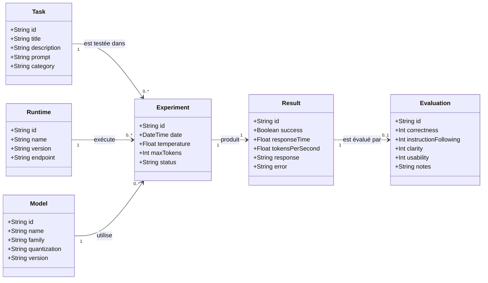

# Diagramme de classes — Artificial Inquiries Exercice 7B

## Sujet

**Ollama vs LM Studio — comparaison de deux environnements d'exécution de LLM locaux**

Ce diagramme représente les principales données nécessaires pour réaliser et documenter les expériences du projet.



## Description des classes

### Task

Représente une tâche utilisée dans le benchmark.

Exemples :

- explication d'un concept ;
- génération de code Python ;
- résumé d'un texte ;
- raisonnement simple.

Une tâche contient principalement le prompt qui sera envoyé aux deux runtimes.

---

### Runtime

Représente l'environnement utilisé pour exécuter le modèle.

Dans ce projet, les deux runtimes principaux sont :

- **Ollama**
- **LM Studio**

Le runtime constitue la principale variable étudiée dans l'expérience.

---

### Model

Représente le modèle de langage local utilisé pendant le test.

Exemples :

- Llama ;
- Mistral ;
- Qwen.

Pour une comparaison équitable, le même modèle et la même quantification doivent être utilisés autant que possible dans Ollama et LM Studio.

---

### Experiment

Représente l'exécution d'une tâche dans une configuration précise.

Une expérience associe :

- une tâche ;
- un runtime ;
- un modèle ;
- des paramètres de génération.

Exemple :

```text
EXP001
Task : T1
Runtime : Ollama
Model : Mistral
Temperature : 0.2
Max Tokens : 512
```

---

### Result

Représente le résultat produit par une expérience.

Il peut contenir :

- la réponse générée ;
- le temps de réponse ;
- le succès ou l'échec ;
- les tokens par seconde si disponibles ;
- un éventuel message d'erreur.

---

### Evaluation

Représente l'évaluation qualitative du résultat.

Les critères prévus sont :

- correction ;
- respect de la consigne ;
- clarté ;
- facilité d'utilisation ;
- observations.

---

## Relations principales

Le fonctionnement général est :

```text
Task
  │
  ▼
Experiment ◄── Runtime
  ▲
  │
Model
  │
  ▼
Result
  │
  ▼
Evaluation
```

Une même tâche peut être exécutée plusieurs fois.

Par exemple :

```text
T1
├── Ollama + Mistral
└── LM Studio + Mistral
```

Cela permet de comparer les résultats des deux runtimes dans des conditions similaires.

## Correspondance avec la méthodologie

Le modèle de données suit la logique de l'expérience :

```text
Choisir une tâche
        ↓
Choisir le modèle
        ↓
Choisir le runtime
        ↓
Créer une expérience
        ↓
Exécuter le prompt
        ↓
Collecter le résultat
        ↓
Évaluer
        ↓
Comparer
```

L'objectif est de conserver autant que possible les mêmes conditions expérimentales et de faire varier principalement le runtime :

**Ollama vs LM Studio**
